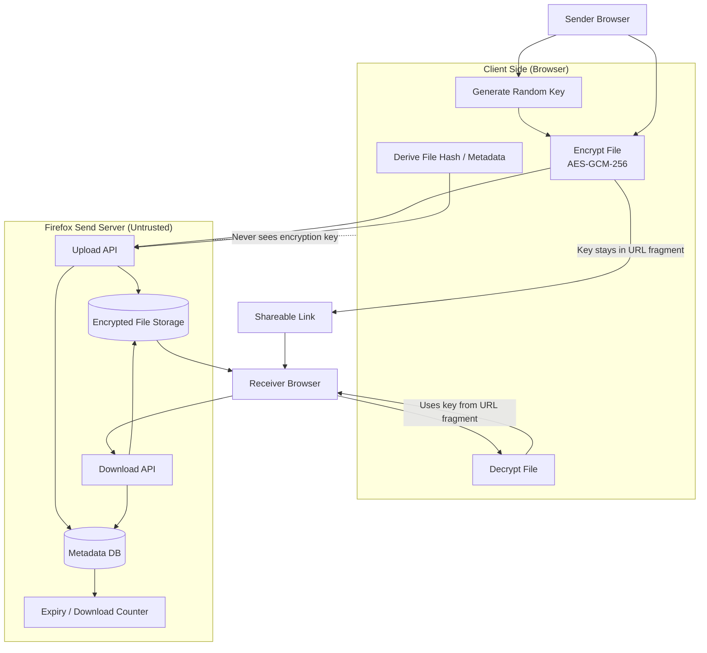

Chithi is based on client-server architecture.

# Overall Architecture

The architecture is based on a [zero-trust backend server](https://www.cloudflare.com/learning/security/glossary/what-is-zero-trust/).

