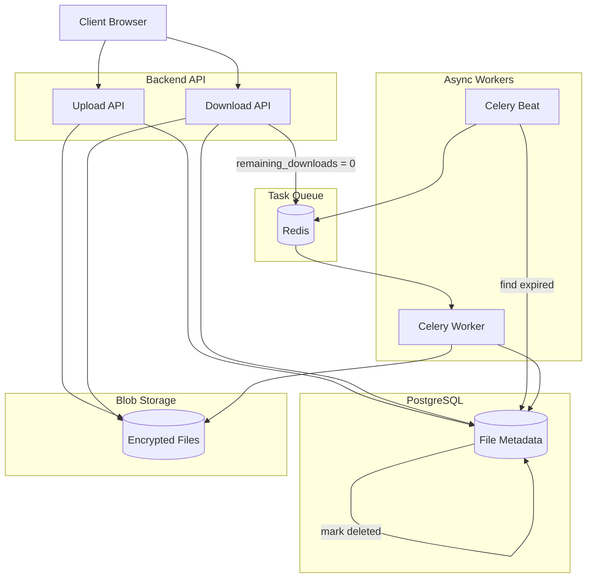

# Backend

The backend handles file deletion and file storage:

```mermaid
flowchart TD
    Client[Client Browser]

    subgraph API["Backend API"]
        UploadAPI[Upload API]
        DownloadAPI[Download API]
    end

    subgraph DB["PostgreSQL"]
        Meta[(File Metadata)]
    end

    subgraph Queue["Task Queue"]
        Redis[(Redis)]
    end

    subgraph Workers["Async Workers"]
        Celery[Celery Worker]
        Beat[Celery Beat]
    end

    subgraph Storage["Blob Storage"]
        Files[(Encrypted Files)]
    end

    %% Upload Flow
    Client --> UploadAPI
    UploadAPI --> Files
    UploadAPI --> Meta

    %% Download Flow
    Client --> DownloadAPI
    DownloadAPI --> Files
    DownloadAPI --> Meta

    %% Cleanup Trigger
    DownloadAPI -->|remaining_downloads = 0| Redis

    %% Periodic Cleanup
    Beat -->|find expired| Meta
    Beat --> Redis

    %% Cleanup Execution
    Redis --> Celery
    Celery --> Files
    Celery --> Meta

    %% Status Update
    Meta -->|mark deleted| Meta

```

The [frontend architecture](../frontend/architecture.md) and the [overall architecture](../architecture/index.md)
