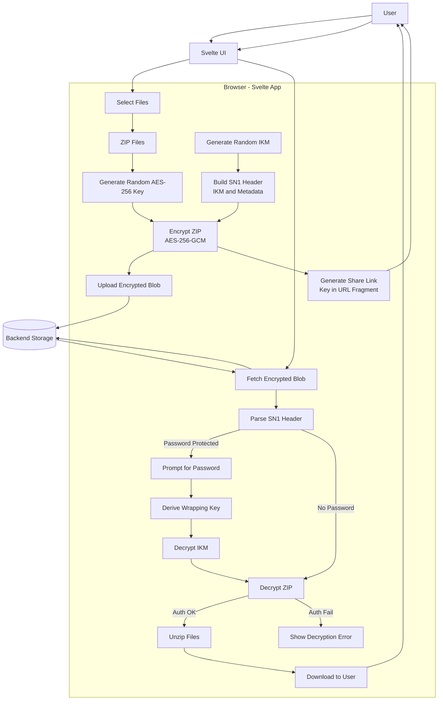

# Frontend

The frontend does the actual encryption/decrpytion:

```mermaid
flowchart TD
    User[User]
    UI[Svelte UI]

    subgraph Client["Browser - Svelte App"]
        Select["Select Files"]
        Zip["ZIP Files"]
        KeyGen["Generate Random AES-256 Key"]
        IKMGen["Generate Random IKM"]
        SN1["Build SN1 Header<br/>IKM and Metadata"]
        Encrypt["Encrypt ZIP<br/>AES-256-GCM"]
        Upload["Upload Encrypted Blob"]
        Link["Generate Share Link<br/>Key in URL Fragment"]

        Fetch["Fetch Encrypted Blob"]
        ParseSN1["Parse SN1 Header"]
        AskPass["Prompt for Password"]
        Derive["Derive Wrapping Key"]
        UnlockIKM["Decrypt IKM"]
        Decrypt["Decrypt ZIP"]
        Unzip["Unzip Files"]
        Download["Download to User"]
        Error["Show Decryption Error"]
    end

    Backend[(Backend Storage)]

    %% Upload Flow
    User --> UI --> Select
    Select --> Zip
    Zip --> KeyGen
    KeyGen --> Encrypt
    IKMGen --> SN1
    SN1 --> Encrypt
    Encrypt --> Upload
    Upload --> Backend
    Encrypt --> Link
    Link --> User

    %% Download Flow
    User --> UI --> Fetch
    Fetch --> Backend
    Backend --> Fetch

    Fetch --> ParseSN1
    ParseSN1 -->|Password Protected| AskPass
    AskPass --> Derive
    Derive --> UnlockIKM
    UnlockIKM --> Decrypt

    ParseSN1 -->|No Password| Decrypt
    Decrypt -->|Auth OK| Unzip
    Decrypt -->|Auth Fail| Error

    Unzip --> Download
    Download --> User

```

The [backend architecture](../backend/architecture.md) and the [overall architecture](../architecture/index.md)
